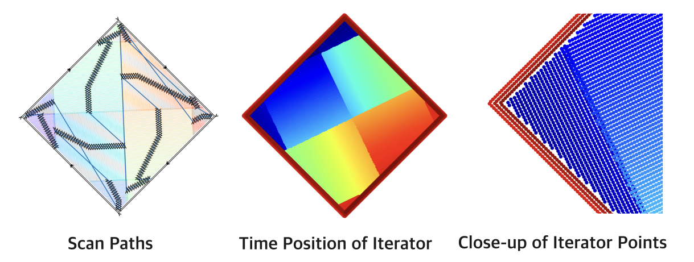

Analysis
===================

Introduction
-------------
The :mod:`pyslm.analysis` module provides the user with the ability to analyse the build process  associated in
raster-based AM processes such as L-PBF (SLM) or EBM.

Using PySLM, the user can analyse the build process of the build-files generated using PySLM or those produced by
external software and imported via `libSLM <https://github.com/drlukeparry/libSLM>`_. Provided the structures
are in the correct format - refer to the :doc:`basic_geometry` section, the user can analyse the build process and
the laser parameters for analysing the build (e.g. build-time) or for deployment in numerical simulations.

Initially, assume that a part has been sliced and hatched using the :mod:`~pyslm.hatching` module, creating suitable
:class:`~pyslm.geometry.Layer` and  :class:`~pyslm.geometry.Model` features defining the geometry per layer
and it is associated laser-parameters used in the process.

.. code-block:: python

    """
    A simple example showing how to iterate across a part using the analysis.Iterator classes
    """
    import numpy as np
    import pyslm
    import pyslm.visualise
    import pyslm.geometry
    import pyslm.analysis
    from pyslm import hatching as hatching#

    # Imports the part and sets the geometry to  an STL file (frameGuide.stl)
    solidPart = pyslm.Part('inversePyramid')
    solidPart.setGeometry('../models/inversePyramid.stl')
    solidPart.rotation = [0, 0.0, 45]
    solidPart.dropToPlatform()

    # Create a StripeHatcher object for performing any hatching operations
    myHatcher = hatching.BasicIslandHatcher()

    # Set the base hatching parameters which are generated within Hatcher
    myHatcher.hatchAngle = 10
    myHatcher.volumeOffsetHatch = 0.08
    myHatcher.spotCompensation = 0.06
    myHatcher.numOuterContours = 1

    # Set the layer thickness
    layerThickness = 0.04 # [mm]

    # Perform the slicing. Return coords paths should be set so they are formatted internally.
    #myHatcher.layerAngleIncrement = 66.7

    #Perform the hatching operations
    print('Hatching Started')

    layers = []

    # Create an individual part for each sample
    model = pyslm.geometry.Model()
    model.mid = 1
    model.name = "Sample {:d}".format(1)

    bstyle = pyslm.geometry.BuildStyle()
    bstyle.setStyle(bid=1,
                    focus=0, power=200.0,
                    pointExposureTime=80, pointExposureDistance=50,
                    laserMode=pyslm.geometry.LaserMode.Pulse)

    model.buildStyles.append(bstyle)

    layerId = 1
    for i in range(2)

        z = i*layerThickness
        # Typically the hatch angle is globally rotated per layer by usually 66.7 degrees per layer
        myHatcher.hatchAngle += 66.7
        # Slice the boundary
        geomSlice = solidPart.getVectorSlice(z)

        # Hatch the boundary using myHatcher
        layer = myHatcher.hatch(geomSlice)

        for geom in layer.geometry:
            geom.mid = 1
            geom.bid = 1

        # The layer height is set in integer increment of microns to ensure no rounding error during manufacturing
        layer.z = int(z*1000)
        layer.layerId = layerId
        model.topLayerId = layerId
        layers.append(layer)
        layerId += 1

    print('Completed Hatching')

Once the structures containing the :class:`~pyslm.geometry.LayerGeometry` features, the analysis can be performed. The
functionality is provided by the :class:`~pyslm.analysis.ScanIterator` class. This class is used to iterate across the
layers and the laser parameters. Create the :class:`~pyslm.analysis.ScanIterator` based on the laser parameters
and geometries specified, the iterator will process the structure and calculate the timings across all layers.

.. code-block:: python
    # Analyse the last layer of the build
    scanIter = pyslm.analysis.ScanIterator([model], layers[-1])

    # Set the parameters for the scan iterator across the layer and also the timestep used.
    scanIter.recoaterTime = 10 # s
    scanIter.timestep = 5e-5 # s - 50 us

Additional information include the :attr:`~pyslm.analysis.Iterator.recoaterTime` can be specified for this calculation.
For discretising the interpolator functions whilst iterating across each scan vector, the
:attr:`~pyslm.analysis.ScanIterator.timestep` can be specified.

Other useful metrics are cached such as the total build time via :meth:`~pyslm.analysis.Iterator.getBuildTime`,
and the number of layers within the build. This takes into account of the intrinsic information such as laser
:attr:`~pyslm.geometry.BuildStyle.jumpDelay` and :attr:`~pyslm.geometry.BuildStyle.jumpSpeed` parameters.

.. code-block:: python

    totalBuildTime = scanIter.getBuildTime()

    print('Total number of layers: {:d}'.format(len(layers)))
    print('Total Build Time: {:.1f}s ({:.1f}hr)'.format(totalBuildTime, totalBuildTime/3600))

Scan Iterator
---------------

:class:`~pyslm.analysis.ScanIterator` behaves as a native python iterator, so that exposure information across time
may be collected incrementally using pythonic notation. Ensure that the scan-iterator is reset to the beginning at
`time=0` by using a small time value ``ScanIterator.seek(1e-6)``. The iterator will interpolate the laser parameters
based on the :attr:`~pyslm.analysis.ScanIterator.timestep` set to a suitably small value, based on the minimum scan-speed.

.. code-block:: python
    # Generate a list of point exposures - note the 3rd column is the current time
    ab = np.array([point for point in scanIter])

This is  useful for plotting the current state of the laser spatially across each layer during the build at a given
time. This could similarly reflect those situations  encountered in a numerical simulation of the build-process.

.. code-block:: python

    import matplotlib.pyplot as plt
    plt.figure()
    plt.scatter(ab[:,0], ab[:,1], c=plt.cm.jet(ab[:,2]/np.max(ab[:,2])))
    plt.gca().set_aspect
    plt.show()

The scan paths can be visualised based on their time or other properties such as the current build-style.

Bear in mind that the iterator will only interpolate linearly across the scan vectors with time. For more complex
situations such as the use of pulsed laser modes, a separate iterator class would have to be created.

Seeking
----------

:class:`~pyslm.analysis.ScanIterator` can be used to seek to a specific layer or time. The iterator will interpolate
the laser parameters inbetween the layers and time. During this, it the iterator will keep track of the current time
and state.

.. code-block:: python

    # reset to layer one
    scanIter.seekByLayer(1)
    print("Current time at layer (1): {:.3f})".format(scanIter.time))

    # Seek based on the time
    scanIter.seek(time=0.4)
    print("Current layer is {:d} @ time = 0.4s".format(scanIter.getCurrentLayer().layerId))

Other information and states can be obtained from the iterator at any current point in time. This is especially
useful for collecting and gather information about the current state of the laser and re-coater at time.

.. code-block:: python

    # Get the current laser state (position, laser parameters, firing)
    laserX, laserY = scanIter.getCurrentLaserPosition()

    islaserOn = scanIter.isLaserOn()
    bstyle = scanIter.getCurrentBuildStyle()

