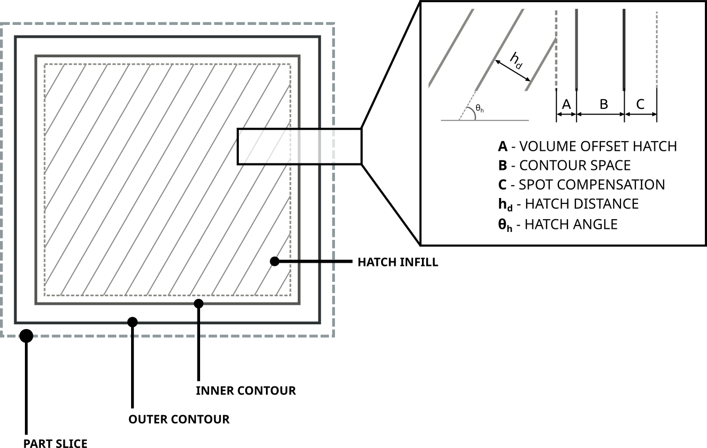

Layer Geometry
===================

Introduction
-------------

In PySLM, the foundation for generating the scan paths for L-PBF is based on a common format for representing the
geometry of a layer within the 'machine build files' used across the majority of commercial LPBF systems.
The typical infill pattern consists of a series of boundaries obtained by slicing that are offset and the interior
region infilled with hatch vectors, constantly spaced with hatch distance :math:`h_d` and orientated at hatch angle
:math:`\theta_h`. The offsets of the boundary are arbitrarily chosen but often compensate for the beam size and additional
offsetting to reduce the likelihood for producing porosity and other defects due to instability in the process.

Subtly, the scan paths are more concise definition and do not follow the typical G-CODE format used across other 3D
printing systems. However, there is a tendency that the definition the scan paths will follow a
similar pattern, that is mostly historically driven by the early L-PBF systems and those based on the original
`.cli <https://www.hmilch.net/downloads/cli_format.html>`_ specification.

The structure of machine build file is that composed from the following sections:

* Header,
* Models,
*  Layers .

The header contains machine specific metadata, and parameters for controlling the build.The models section contains
details about individual parts within a build and  a selection of Laser Parameters grouped as Build Style. Finally,
as this remains a planar process the layers section, at a prescribed build height in the :math:`Z` direction. Each layer
contains the various 2D layer geometry that describe the infill raster pattern used for controlling the
scan-paths taken by the exposure sources. The common layer geometry types are 1D exposures or 2D scan vectors that
are linearly discretised across the layer:

* Hatches
* Contours / Boundaries
* Points

Geometry Structure
----------------------
PySLM builds upon these structures throughout to provide a universal interface for generating
layer geometry features (i.e. scan-vectors) and subsequent translation to associated machine build files
that can be utilised across a range of commercial L-PBF systems via `libSLM  <https://github.com/drlukeparry/libSLM>`_
and simulation tools. These structures are defied in the :mod:`pyslm.geometry` module, which will transparently load libSLM
if available.

Parts and their Laser Parameters are contained within :class:`~pyslm.geometry.Model`. Each model at a minimum
must contain a unique :attr:`~pyslm.geometry.Model.mid` (model id) and the
:attr:`~pyslm.geometry.Model.topLayerId`. The ``top layer id`` identifies the uppermost layer that contains the highest Z value for
any :class:`~pyslm.geometry.LayerGeometry` that is associated for a model group. The model can also contain a list
of :class:`~pyslm.geometry.BuildStyle` that define the choice of laser parameters.

.. note::
    Currently it is assumed that laser parameters are assigned to a group of scan vectors. In future, some system support
    may be added to allow for the assignment of laser parameters to individual scan vectors.

A :class:`~pyslm.geometry.Model` can be created as follows:

.. code-block:: python

    from pyslm.geometry import Model

    # Create a model
    model = Model(mid=1, topLayerId=10)

    # Attribute can be seperately assigned
    model.mid = 1
    model.topLayerId = 10

Build Styles
-----------------
Each build style contains a unique  :attr:`~pyslm.geometry.BuildStyle.bid` and a set of laser parameters typical
across most L-PBF systems. These can be attached to each :class:`~pyslm.geometry.Model`. The laser parameters are
referenced by each :class:`~pyslm.geometry.LayerGeometry` using their `mid` and `bid` references respectively. Therefore,
it is required that each model contains at least one build style and are uniquely identifiable.

.. code-block:: python

    from pyslm.geometry import BuildStyle

    bstyle = pyslm.geometry.BuildStyle()
    bstyle.bid = 1
    bstyle.laserSpeed = 200  # [mm/s]
    bstyle.laserPower = 200  # [W]
    bstyle.jumpSpeed  = 5000 # [mm/s]

    # Create a second build style with a unique name
    bstyle2 = pyslm.geometry.BuildStyle(bid=2)
    bstyle2.laserSpeed = 200  # [mm/s]
    bstyle2.laserPower = 200  # [W]

    # Attached the build styles to the model
    model.buildStyles.append([bstyle, bstyle2])

An additional set of laser parameters can be defined for each build style, which are specifically associated with the
`pyslm.analysis` module, for calculating the build times and estimate energy consumption. These may not necessarily
used by the L-PBF system when exported to the machine build files. These are defined as follows:

.. code-block:: python

    # Optional laser param
    bstyle.jumpSpeed  = 5000 # [mm/s] - The jump speed used when jumping betwee scan vectors
    bstyle.jumpDelay  = 10   # [mu s] - The jump delay used when jumping between scan vectors
    bstyle.pointDelay = 10   # [mu s] - The point delay used when exposing a point (Pulsed laser systems)

The laser parameters are stored in the :class:`~pyslm.geometry.BuildStyle` object and other machine specific parameters
can be defined and are stated below for reference:

* :attr:`~pyslm.geometry.BuildStyle.pointExposureTime` - Point Exposure Time [:math:`\mu`s] for Pulsed Laser Systems
* :attr:`~pyslm.geometry.BuildStyle.pointDistance` - Point Exposure Distance [:math:`\mu`m] for Pulsed Laser Systems
* :attr:`~pyslm.geometry.BuildStyle.laserFocus` - Laser focus position [mm] for some laser systems
* :attr:`~pyslm.geometry.BuildStyle.laserId` - Laser ID for multi-laser systems
* :attr:`~pyslm.geometry.BuildStyle.description` - A description of the build style

The parameters may be used during translation using libSLM.

.. note::

        The laser parameters required to be specified is not exhaustive, and will depend on the L-PBF platform utilised.
        For example, depending on the laser type (CW, or Pulsed) the laser speed parameter may be defined, or the
        point exposure time and distance.

Each :class:`~pyslm.geometry.Layer`  contains a unique
(:attr:`~pyslm.geometry.Layer.layerId`) and (:attr:`~pyslm.geometry.Layer.z`) position stored as microns. Within
each layer, this stores the layer geometry, which is an ordered list of :class:`~pyslm.geometry.LayerGeometry` features.
These are processed in the order they are stored in  :attr:`pyslm.geometry.Layer.geometry`.

:class:`~pyslm.geometry.LayerGeometry` is a base class, and in practice derived geometry types can be used:

* :class:`~pyslm.geometry.HatchGeometry` - Scan vectors defined by pair-wise coordinates with jumps between
* :class:`~pyslm.geometry.ContourGeometry` - Scan vectors that are connected to form a closed loop
* :class:`~pyslm.geometry.PointsGeometry` - A sequence of point exposures

Each geometry type must reference a :class:`~pyslm.geometry.BuildStyle` and :class:`~pyslm.geometry.Model` object
using the :attr:`~pyslm.geometry.BuildStyle.bid` and :attr:`~pyslm.geometry.BuildStyle.mid` attributes respectively.
Crucially, the coordinates defining the exposure points and vectors are stored in the
:attr:`~pyslm.geometry.LayerGeometry.coords`. The coordinates are stored as a numpy array with shape (n, 2) where n is
the number of points and are stored typically using mm.

.. note::
    Typically for visualisation, hatch vectors are representing using a numpy array with shape `(n,2,2)` where n is the
    number of hatch vectors to represent the pair of coordinates.

The following example demonstrates how to create a layer geometry with a contour and hatch geometry for a single layer.

.. code-block:: python

    import pyslm.visualise
    from pyslm.geometry import Layer, ContourGeometry, HatchGeometry

    layer = Layer(layerId=1, z=30)

    contourGeom = ContourGeometry()
    contourGeom.mid = 1
    contourGeom.bid = 1  # Use the first build style for hatch vectors
    contourGeom.coords = np.array([[0., 0], [1., 0], [1., 1.], [0., 1.], [0., 0.]])

    hatchGeom = geom.HatchGeometry()
    hatchGeom.mid = 1
    hatchGeom.bid = 2 # Use the second build style for hatch vectors
    hatchGeom.coords = np.array([[0.1, 0.1], [0.9, 0.1], # Hatch Vector 1
                                 [0.1, 0.3], [0.9, 0.3], # Hatch Vector 2
                                 [0.1, 0.5], [0.9, 0.5], # Hatch Vector 3
                                 [0.1, 0.7], [0.9, 0.7], # Hatch Vector 4
                                 [0.1, 0.9], [0.9, 0.9]  # Hatch Vector 5
                                ])

    # Append the layer geometry to the layer
    layer.geometry = [hatchGeom, contourGeom]

Validation
-----------------

Generated geometry can be validated using an additional utility :class:`~pyslm.geometry.ModelValidator` . This class
which will check the structures for consistency and ensure that the geometry is correctly defined throughout. This is
important for large build files consisting multiple models and build styles, and difficulty identify problems that
can occur when exporting to machine build files.

:class:`~pyslm.geometry.ModelValidator` is supplied with a list of :class:`~pyslm.geometry.Layer` and
:class:`~pyslm.geometry.Model` , and internally will check for consistency. The following short example demonstrates how to
validate the geometry used as input prior to generating a machine build file:

.. code-block:: python

        import pyslm.geometry

        # Create a list of models and a list of layers
        models = [model]
        layers = [layer]

        """ Validate the input model """
        pyslm.geometry.ModelValidator.validateBuild(models, layers)

Exporting
------------

Once the build file structures are defined, these can be used to export to a machine build file format via
`libSLM <https://github.com/drlukeparry/libSLM>`_. Additionally, these files can be imported back into PySLM and
re-used for further analysis or visualisation. There are a variety of formats currently available including:

* Renishaw (**.mtt**)
* DMG Mori - Realizer (**.rea**)
* EOS (**.sli**)
* SLM Solutions (**.slm**)
* CLI (**.cli**) - Common Layer Interface

For further guidance, including installation please refer to the `libSLM <https://github.com/drlukeparry/libSLM>`_ documentation.
Generally, the process is very trivial once the prior structures has been generated. Additional information may be
required specific to the L-PBF system,  and additionally a header structure for defining additional build parameters
or metadata. The following example demonstrates how to export the geometry to a Renishaw machine build file (`.mtt`):

.. code-block:: python

    from libSLM import mtt

    """
    A header is needed to include an internal filename. This is used as a descriptor internally for the Machine Build File.
    The translator Writer in libSLM will specify the actual filename.
    """
    header = slm.Header()
    header.filename = "MachineBuildFile"

    # Depending on the file format the version should be provided as a tuple
    header.version = (1,2)

    # The zUnit is the uniform layer thickness as an integer unit in microns. Normally should be set to 1000
    header.zUnit = 1000 # μm

    """ Create the initial MTT Writer Object and set the filename"""
    mttWriter = mtt.Writer()
    mttWriter.setFilePath("build.mtt")
    mttWriter.write(header, models, layers)

For other machine build file formats, these are constructed similarly, but will have specific parameters or modifications
required to be accepted by the system.
Likewise machine build files can be imported back into PySLM for further analysis or visualisation.

.. code-block:: python

    from libSLM import mtt
    import pylsm.visualisation

    mttReader = mtt.Reader()
    mttReader.setFilePath("build.mtt")
    mttReader.parse()

    layers = mttReader.layers
    pyslm.visualisation.plot(layers[0])