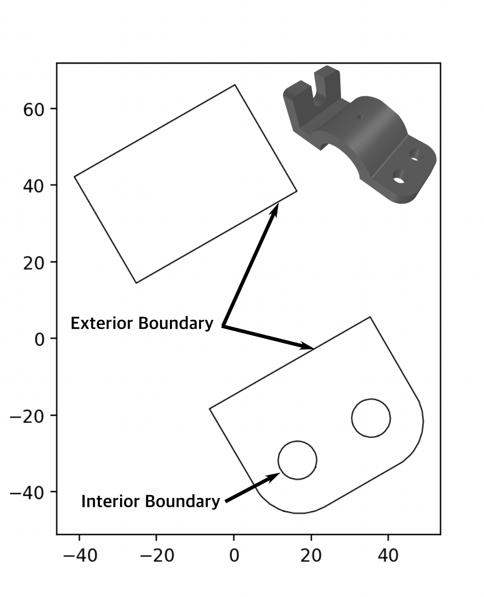
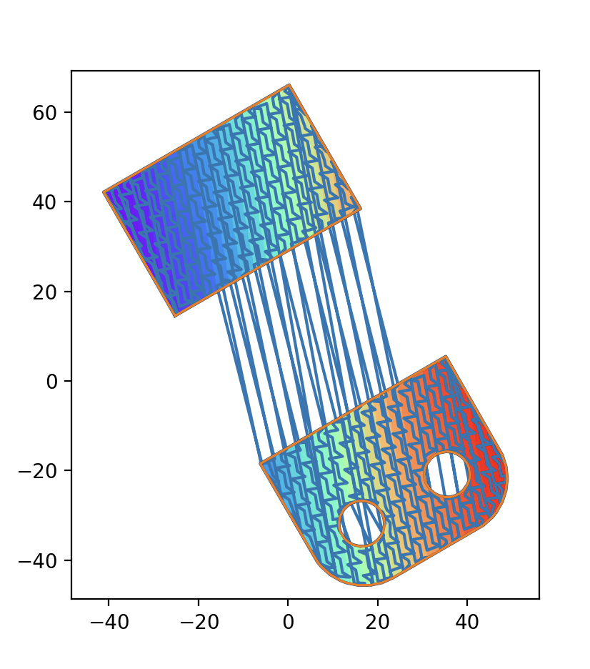
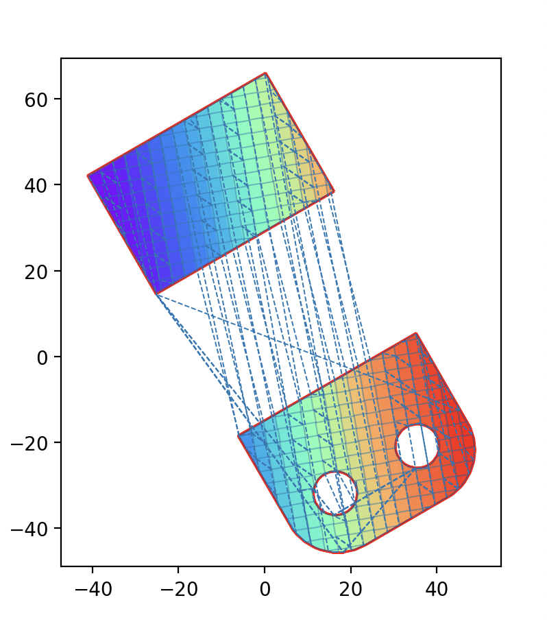

Slicing and Hatching
==============================

Introduction
---------------------------
Hatching is a vital operation of scanner based additive manufacturing processes, typically encountered across
powder-bed fusion processes such as selective laser sintering (SLS), selective laser melting (SLM), and electron beam
melting (EBM), that operate in a planar layer-wise fashion.  The hatching process generates the required raster path
for filling a geometry by controlling the exposure source on a medium such as powder to consolidate the underlying
material. PySLM is not currently focused on generating paths for extrusion based processes such as FDM, as there many
other open source packages that already provide this functionality.

This guide will show you how to use the basic hatching functionality available in the
`pyslm.hatching` module. The `hatching` module inside pyslm provides the basic underlying framework for
offsetting and hatching polygonal boundaries passed that are typically obtained from a set of slicing operations on a
volumetric object, which typically are a triangular mesh encapsulated by `trimesh.Trimesh`. However, alternative means for
obtaining geometry can be used such as implicit fields for lattice volumes,
or those generated procedurally, including functions such as Hilbert Curves. Fundamentally, the only requirement is the
generation of polygonal boundaries which form the basis of offsetting and hatching operations.

Structure of PySLM
----------------------
In the hatching module there are a variety of classes available that demonstrate the flexibility and capability offered
for generating alternative infills produce a variety of scan strategies employed in these processes including:

* meander / serpentine,
* island / checkerboard,
* stripe.

Although, in practice these can be extended to any infill pattern.

The core hatching functionality is included in :class:`pyslm.hatching.BaseHatcher`, which contains the functions for manipulating
the geometry and for performing basic offsetting and clipping of scan vectors. This is built-upon external functionality
offered by the `shapely <https://shapely.readthedocs.io>`_ and `pyclipr <https://github.com/drlukeparry/pyclipr>`_
(`ClipperLib2 <https://github.com/AngusJohnson/Clipper2>`_) libraries that provide polygon clipping operations including
intersection and offsetting functionality.

PySLM Parts
--------------------------------

:class:`~pyslm.core.Part` geometry can created from an input mesh geometry supported by those native in the
`trimesh` library, which typically include .stl, .ply and .3mf. The geometry can be imported by using the
:meth:`~pyslm.core.Part.setGeometry` method. The part can be transformed using the in-built methods.

.. note::

    The `trimesh` library is required for the import of mesh geometries. This can be installed using `pip install trimesh`.

.. code-block:: python

    # Create a part from a mesh
    solidPart = Part()
    solidPart.setGeometry('../models/frameGuide.stl')

    # Drop the part to the build platform
    solidPart.dropToBuildPlatform()

Basic transformation operations (e.g. rotation, translation and scaling), can be applied to the
geometry, especially those which include dropping the part within a distance from the build-plate by using
:meth:`~pyslm.core.Part.dropToPlatform` method.

The underlying representation in `trimesh` can be accessed in the :attr:`~pyslm.core.Part.geometry` attribute.
The transformation are applied on demand when required.  However, if the in-built transformations are modified
directly since python uses references, the user should call :meth:`~pyslm.core.Part.regenerate` to ensure the internal
mesh is updated.

.. code-block:: python

        # Rotate the part
        solidPart.rotate([0, 0, 1], np.pi/4)

        # Scale the part
        solidPart.scale(0.5)

        # Modifying the vertical component of the part origin directly
        solidPart.translate[3] = 20.0
        solidPart.regenerate()

:class:`~pyslm.core.Part` aims to provide the foundation for other 3D printing relevant utilities and functionality
in the future, rather than replicating existing functionality offered by the already extensive `trimesh` library.
Nevertheless, there are some convenience functions available for accessing the underlying mesh geometry.

.. code-block:: python

    # Access the trimesh geometry
    trimeshGeom = solidPart.geometry

Basics of Slicing and Hatching
--------------------------------

The :class:`~pyslm.hatching.BaseHatcher` class provides the majority of key functionality in 2D for performing the
offsetting and hatching operations. Many convenience functions are provided for operating on geometries that can be
extended across many other AM processes. These include fundamental clipping and boolean operations required for the
generation of scan vectors.

:class:`~pyslm.hatching.BaseHatcher` is provided with boundaries typically generated from a slicing operation obtained
from mesh geometry. These boundaries are offset to create a series of internal coordinates and the interior is infilled
using a series of hatches or potentially other infill patterns.

.. code-block:: python

    from pyslm import hatching
    from pyslm.hatching import BaseHatcher
    from pyslm.hatching import HatchStyle

    # Create a BasicIslandHatcher object for performing any hatching operations
    myHatcher = hatching.BasicHatcher()

The :class:`~pyslm.hatching.BaseHatcher` requires some parameters to be set for both the number and distance between
offsets of the boundary and those used during hatching phase. Primarily the user should define the hatch distance,
:math:`h_d`,  and the hatch angle :math:`\theta_d` provided in degrees.

.. code-block:: python

    # Set the base hatching parameters which are generated within Hatcher
    myHatcher.hatchAngle = 10 # [°] The angle used for the islands
    myHatcher.volumeOffsetHatch = 0.08 # [mm] Offset between internal and external boundary
    myHatcher.spotCompensation = 0.06 # [mm] Additional offset to account for laser spot size
    myHatcher.numInnerContours = 2
    myHatcher.numOuterContours = 1
    myHatcher.hatchSpacing = 0.1 # [mm] The spacing between hatch lines

These parameters can be modified at any point during the hatching process across a set or group of boundaries
(closed polygons) or between layers.

The boundaries of any geometry are passed to the :class:`~pyslm.hatching.BaseHatcher` object using the
:meth:`~pyslm.hatching.BaseHatcher.hatch` method. The boundaries must be
closed connected paths that typically originate from  watertight (manifold) geometry in a mesh. These can be obtained
from a variety of means but typically are obtained from a slicing operation on a mesh that can be performed directly
in PySLM. Alternative methods doe exist for other geometries (e.g. implicit models -
see `examples/implicit_surface.py <https://github.com/drlukeparry/pyslm/blob/master/examples/example_implicit_surface.py>`_).
or those generated procedurally. Irrespective of the source, the boundaries must be closed and connected.

The slicing can be obtained from the part using the :meth:`~pyslm.core.Part.getVectorSlice` method. This method returns
a set of closed 2D polygons consisting of interior and exterior paths, correctly orientated for later use in offsetting
and hatching. For complex geometries, it is recommended to apply the ``simplificationFactor`` within the hatch argument
in order to reduce the number of line segments representing the boundary.

.. code-block:: python

    # Get the slice of the part at Z height
    z = 0.1
    geomSlice = solidPart.getVectorSlice(z, simplificationFactor=0.1)

Geometrical boundaries of different types including a list of closed paths, shapely polygons can be plotted
using a convenience method :meth:`pyslm.visualise.plotPolygon`.

These can be provided to the hatching infill strategy accordingly. This will create suitable scan vector structures used for
processing by most commercial PBF systems, which consist of fundamental types defined in `pyslm.hatching`.

In principle, the :meth:`~pyslm.hatching.BaseHatcher.hatch` method will generate and offset a set of borders
(:class:`pyslm.geometry.ContourGeometry`), and for the interior, infilling with a series of hatch vectors across
each region (:class:`pyslm.geometry.HatchGeometry`). Parameters must be separately be defined for each set of scan vector
types, and these parameter sets are specific to different L-PBF platforms. The user can specify the strategy chosen
using the :meth:`~pyslm.hatching.BaseHatcher.hatch` method, which can apply to other derived classes too. The in-built
hatch methods will offset the boundary and infill using a particular scan-strategy.

.. code-block:: python

    # Hatch the geometry
    hatchLayer = myHatcher.hatch(geomSlice)

Visualisation
----------------
There are variety of functions and tools available for visualising geometry and scan paths generated using SLM.
The hatch layer can then be visualised with functions provided in `pyslm.visualise` module using a variety
of plotting options, currently built on top of the matplotlib library.

.. code-block:: python

    pyslm.visualise.plot(layer, plot3D=False, plotOrderLine=True, plotArrows=False)

Alternatively, plots can be showed sequentially in time using the
:meth:`~pyslm.visualise.plotSequential` function, which can include the jumps between scan vectors by setting the parameter
`plotJumps` to `True`.

.. code-block:: python

    pyslm.visualise.plotSequential(layer, plot3D=False, plotJumps=True)

Further details about visualisation are presented in the :doc:`basic_visualisation` section.

Assigning Models and Build Styles
-----------------------------------
Before exporting or analysing the scan vectors, a :class:`~pyslm.geometry.Model` and :class:`~pyslm.geometry.BuildStyle`
need to be created and assigned to each :class:`~pyslm.geometry.LayerGeometry`  groups that were created during the
slicing and hatching process. The user has to assign a model id (:attr:`~pyslm.geometry.LayerGeometry.mid`) and build style id
(:attr:`~pyslm.geometry.LayerGeometry.bid`) to these attributes withing each layer geometry, corresponding to the
assigned laser parameters used across the L-PBF process. These parameters are necessary for also correctly calculating
the time and duration taken during scanning. Further information can be found in the :doc:`basic_geometry` section.

.. code-block:: python

    import pyslm.analysis

    # For each layer geometry assign the same model and build style
    for layerGeom in layer.geometry:
        layerGeom.mid = 1
        layerGeom.bid = 1

    # Create a build style and include basic laser parameters
    bstyle = pyslm.geometry.BuildStyle()
    bstyle.bid = 1
    bstyle.laserSpeed = 200  # [mm/s]
    bstyle.laserPower = 200  # [W]
    bstyle.jumpSpeed  = 5000 # [mm/s]

    # Create a model and assign the build style
    model = pyslm.geometry.Model()
    model.mid = 1
    model.buildStyles.append(bstyle)

Once these are set, these structures can be used for exporting the scan vectors to a variety of formats via libSLM or
for analysis of the build process or for use in other applications such as simulation.

Analysing Scan Paths
----------------------
Analysis of the layers can be achieved using the `pyslm.analysis` module. The path distance and the estimate time taken
to scan the layer can be predicted. Additionally other information during the build process such as the jump distance
can be obtained.

.. code-block:: python

    import pyslm.analysis

    # Obtain geometrical information for the layer
    print('Total Path Distance: {:.1f} mm'.format(pyslm.analysis.getLayerPathLength(layer)))
    print('Total jump distance {:.1f} mm'.format(pyslm.analysis.getLayerJumpLength(layer)))

    # Estimate the time taken to scan the layer using the model
    print('Time taken {:.1f} s'.format(pyslm.analysis.getLayerTime(layer, [model])) )

.. note::

    The :attr:`~pyslm.geometry.BuildStyle.pointDistance` parameter must be set or this method will fail.

This outlines the basic functionality and features covered by PySLM. The premise of PySLM is that it provides a
modular set of building blocks available for controlling and modelling the paths generated in Additive Manufacturing.
