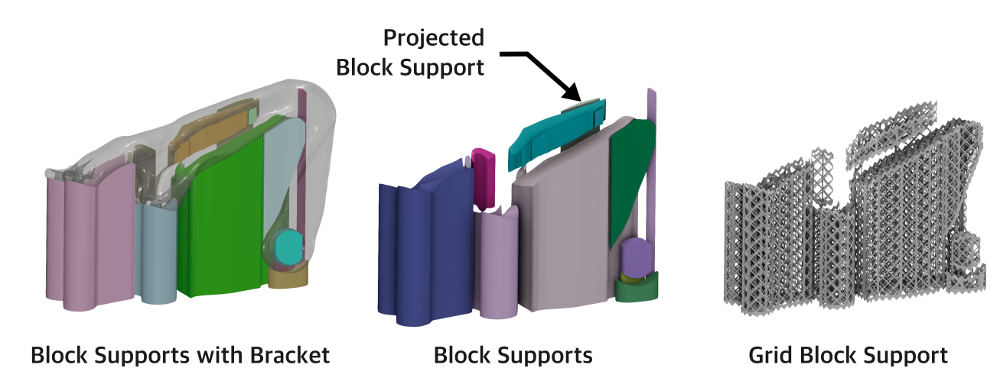
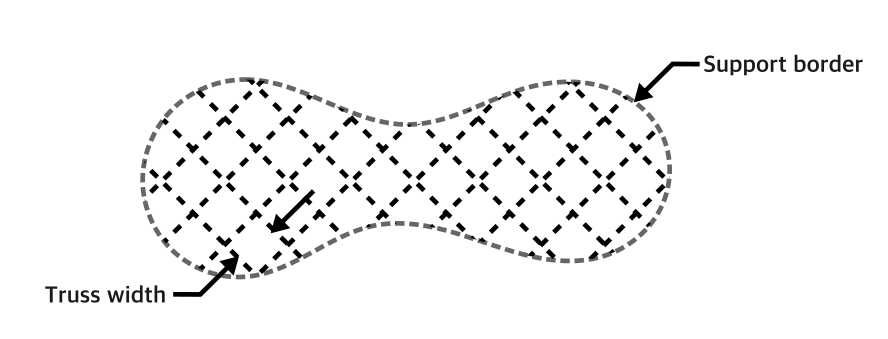
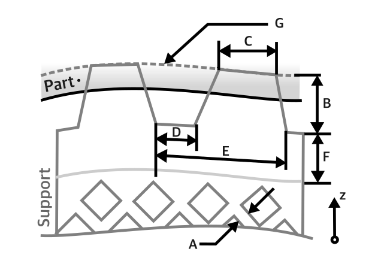
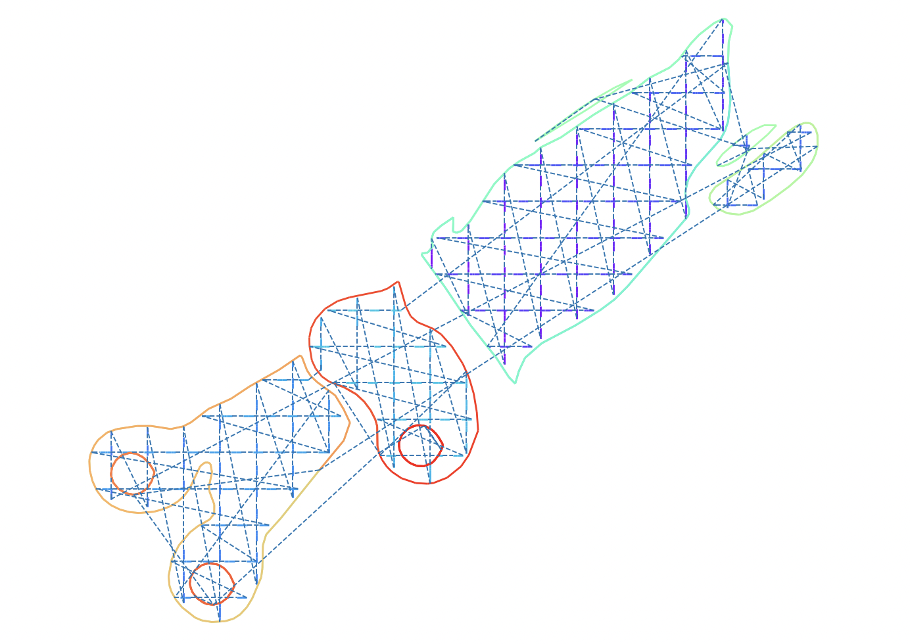

Support Generation
==============================

This tutorial will show you how to generate the basic support generation functionality available in the
:mod:`pyslm.support` module. The generation of support structures remains a critical aspect within the majority of
AM processes. The support structures are used to provide a means of connecting overhanging regions (<45°) to the build
platform and to ensure buildable specific to the targeted AM process. The support structures are typically removed after the
completion of the build. Careful generation is necessary to reduce waste material, build-time and reduce post-processing
requirements.

The support generation module in PySLM provides a set of classes and functions to investigate the generation
on additively manufactured parts, especially those produced in L-PBF processes. The module builds upon several external
libraries including `vispy`, `manifold3d`, `triangle` and `mapbox-earcut` to provide the capability. It is therefore
necessary to ensure that these libraries are installed before using the support generation module.

Further example usage is shown in `examples/support_generation.py <https://github.com/drlukeparry/pyslm/blob/master/examples/example_support_structure.py>`_.

Structure of the Support Generation Module:
--------------------------------------------
Support functionality is contained within the `pyslm.support` module. The module provides a set of classes and functions
related to identify support regions and their subsequent projection of their volumes principally. Additionally, there are
currently a set of functions for generating truss based support structure suitable for L-PBF processes.

The generation of supports is performed by a utility ‘generator‘ class :class:`~pyslm.support.BaseSupportGenerator`
and incidentally their derived classes such as:

* :class:`~pyslm.support.BlockSupportGenerator` – Generates block volume support regions
* :class:`~pyslm.support.GridBlockSupportGenerator` – Generates grid truss block support suitable for L-PBF (SLM)

These classes perform the overhang and support analysis to extract the overhang surfaces from a triangular mesh using the
`Trimesh` library. From the overhang surface, the support volumes are then generated using these to provide the inputs
for the creation of support objects that provide the foundation for generating different supports.
For the objects representing the actual support structures, and regions, these are split into the following classes:

* :class:`~pyslm.support.SupportStructure` – Base class defining a part’s surface requiring support
* :class:`~pyslm.support.BlockSupportBase` – Tne base class for a Support block volume for providing a region to support
* :class:`~pyslm.support.GridBlockSupport` – Generates a support with a grid trust suitable for L-PBF (SLM)

The support generation process is performed in the following steps:

1. Overhang detection
2. Support volume identification
3. Support geometry generation
4. Support slicing

Overhang Identification
-------------------------

The first step, widely available amongst all CAD and pre-processing software is overhang identification.
Determining the face angles is a trivial process and in PySLM may be obtained using the following function
:meth:`pyslm.support.getSupportAngles`. The function takes the trimesh object and calculates the dot product
of the surface normal across the mesh. Upon obtaining the dot product, the angle between the vectors is calculated
and for convenience is converted from rads to degrees. Upon obtaining the surface angles, the overhang mesh regions can
be extracting from the originating mesh. The basic derivation is shown below for completeness.

.. code-block:: python

    # Normal to the Z Plane
    v0 = np.array([[0., 0., -1.0]])

    #Identify Support Angles
    v1 = part.geometry.face_normals

    # Calculate the angle (degrees) between the face normals and the Z-plane
    theta = np.arccos(np.clip(np.dot(v0, v1.T), -1.0, 1.0))
    theta = np.degrees(theta).flatten()

    # Extract a list of faces that are below the critical overhangAngle specified
    supportFaceIds = np.argwhere(theta > 180 - overhangAngle).flatten()

    # Create the overhang mesh by splitting the meshing when needed.
    overhangMesh = trimesh.Trimesh(vertices=part.geometry.vertices,
                                   faces=part.geometry.faces[supportFaceIds])
    if splitMesh:
        return overhangMesh.split(only_watertight=False)

The actual usage is for most users is across the following two functions :meth:`pyslm.support.getOverhangMesh` and
:meth:`pyslm.support.getOverhangAngles`. The former function returns the overhang mesh and the latter the overhang angles.
A :class:`~pyslm.core.Part` is required for their generation.

.. code-block:: python

    import trimesh
    import pyslm
    import numpy as np

    # Load the mesh and create a PySLM part
    geometry = trimesh.load_mesh('path/to/mesh.stl')
    part = pyslm.Part(geometry)

    # Get the overhang mesh
    overhangMesh = pyslm.support.getOverhangMesh(part, overhangAngle=45.0, splitMesh=True)

    # Get the overhang angles
    overhangAngles = pyslm.support.getOverhangAngles(part, overhangAngle=45.0)

Splitting the overhang mesh is far more convenient in terms of processing the support structures.
It also improves the performance by reducing the projected area when performing ray intersections to identify an
approximate volume. Additionally, separate meshes can be easily filtered based on their area

.. code-block:: python

    # Split the overhang mesh
    overhangMesh = pyslm.support.getOverhangMesh(part, overhangAngle=45.0, splitMesh=True)

    # Filter the overhang mesh based on their area d
    for mesh in overhangMesh:
        if mesh.area < 0.1:
            continue
        # Do something with the mesh

    # Alternative approach
    filteredMeshes = [mesh for mesh in overhangMesh if mesh.area > 0.1]

A comparison to a threshold overhang or support angle is made and used as a mask to extract the face indices from the
mesh in order to obtain a new mesh. It is common that the overhang regions are disconnected. These can optionally be
split using `trimesh.split`, which uses the internal connectivity of vertices in the mesh in a connected-component
algorithm to isolate separate regions.

Support Volume Identification and Generation
-----------------------------------------------

Upon obtaining the overhang mesh, the next step is to generate the support volumes. This is performed by the
an extensive list of functions to provide conformal volumes that are  projected from the part's overhang regions. These
primary functions are contained in :class:`~pyslm.support.BaseSupportGenerator` and its derived classes that provide the
differentiated support.

The boundaries of these overhang areas are offset by a set distance, and are then  smoothed using a b-spline fit
and extruded to provide the support volumes that are intersected with the original mesh to provide conformal volumes
stored as a :class:`~pyslm.support.BlockSupportBase`.

.. image:: ../images/examples/lpbf_slm_support_structure_projection.png
   :width: 600
   :align: center
   :alt: Identification of support structure generation in 3D Printing (Additive Manufacturing)

The support volumes are generated by projecting the overhang mesh using ray-tracing methods
back onto the original part. Through this process, it will identify regions that self-intersecting with the mesh and
those that are not. The basic parameters that are used to control the support generation are as follows:

.. code-block:: python

    supGen = pyslm.support.BlockSupportGenerator()

    supGen.rayProjectionResolution = 0.05 # [mm] - The resolution of the grid used for the ray projection
    supGen.innerSupportEdgeGap = 0.3      # [mm] - Inner support offset used between adjacent support distances
    supGen.outerSupportEdgeGap = 0.3      # [mm] - Outer support offset used for the boundaries of overhang regions
    supGen.simplifyPolygonFactor = 0.5    #      - Factor used for simplifying the overall support shape
    supGen.triangulationSpacing = 2.0     # [mm] - Used for triangulating the extruded polygon for the bloc
    supGen.minimumAreaThreshold = 0.1     # Minimum area threshold to not process support region'
    supGen.triangulationSpacing = 4       # [mm^2] - Internal parameter used for generating the mesh of the volume
    supGen.supportBorderDistance = 2.0    # [mm]

These parameters generally remain sensitive to the input geometry and are currently tied to the scale of the geometry.
In order to generate a list of :class:`pyslm.support.BlockSupportBase`. These provide basic information including the
geometry of the identified support volumes and other information such as the original overhang area identified on the
part provided in the generator. To instantiate the support volumes, once  :class:`~pyslm.support.BaseSupportGenerator`
has been created, the following function is used to identify the block regions based on the desired overhang angle.

.. code-block:: python

    overhangAngle = 45
    supportBlockRegions = supportGenerator.identifySupportRegions(myPart, 45, True)

The generated mesh and properties of each support can extracted individually from each
:class:`~pyslm.support.BlockSupportBase` as follows:

.. code-block:: python

    for support in supportBlockRegions:
        # Support geometry mesh
        supportMesh = support.geometry

        # Exterior boundary
        boundary = support.supportBoundary

Each block support is separate and can be filtered or generated individually
for previewing by the user or for selection later.

Grid Truss Supports for L-PBF
--------------------------------
These support volumes provide the basis for infilling with parts, but standalone offer little value to the user for
a particular process. In the case of L-PBF processes, the support structures are typically truss based and include
additional features such as the ability to add drainage holes, perforate teeth that intersect into the part.

The support geometries are also specially designed to produce shell meshes, rather than 3D volume. During slicing these
promote efficient scanning by the laser along consecutive line segments that are more faster to build with less material
wastage.

The generation of these supports is performed by the :class:`~pyslm.support.GridBlockSupportGenerator` class that
is built onto the  :class:`~pyslm.support.BaseSupportGenerator`. This class extends the geometry generation process further
for generating a conformal truss grid structure within the support volumes. The grid truss support structure is
generated similarly as before, with a few additional geometric parameters for controlling the generation of the truss:

.. code-block:: python

    supGen = pyslm.support.GridBlockSupportGenerator()

    supGen.rayProjectionResolution = 0.05 # [mm] - The resolution of the grid used for the ray projection
    supGen.innerSupportEdgeGap = 0.3      # [mm] - Inner support offset used between adjacent support distances
    supGen.outerSupportEdgeGap = 0.3      # [mm] - Outer support offset used for the boundaries of overhang regions
    supGen.simplifyPolygonFactor = 0.5    #      - Factor used for simplifying the overall support shape
    supGen.triangulationSpacing = 2.0     # [mm] - Used for triangulating the extruded polygon for the bloc
    supGen.minimumAreaThreshold = 0.1     # Minimum area threshold to not process support region'
    supGen.triangulationSpacing = 4       # [mm^2] - Internal parameter used for generating the mesh of the volume
    supGen.supportBorderDistance = 2.0    # [mm] - The distance to offset the support boundary on the outer skin
    supGen.numSkinMeshSubdivideIterations = 2 # Number of iterations to subdivide the outer skin mesh

For control over the exact generation of the grid truss geometry, these can be controlled by the following main parameters
for the grid :attr:`~pyslm.support.GridBlockSupport.trussWidth` and the :attr:`~pyslm.support.GridBlockSupport.gridSpacing`:

.. code-block:: python
    supGen.gridSpacing = [5,5] # [mm] The spacing of the grid
    supGen.trussWidth  = 1.0   # [mm] The width or thickness of the truss itself

The grid truss spacing parameter forms the equally spaced grid that is used to generate the truss structure. Currently
this is a square grid, but future versions will allow for more complex grid structures.

Additionally properties needed to specified related to the perforated teeth and additional control over the truss
support structure can be set to control their generation.

The parameters for controlling the generation of the truss grid are:

* (**A**) truss width (:attr:`~pyslm.support.GridBlockSupport.trussWidth`),
* (**B**) teeth height (:attr:`~pyslm.support.GridBlockSupport.supportTeethHeight`),
* (**C**) teeth upper length (:attr:`~pyslm.support.GridBlockSupport.supportTeethTopLength`),
* (**D**) teeth lower length (:attr:`~pyslm.support.GridBlockSupport.supportTeethBottomLength`),
* (**E**) teeth base interval (:attr:`~pyslm.support.GridBlockSupport.supportTeethBaseInterval`),
* (**F**) support boundary offsetting for strengthening (:attr:`~pyslm.support.GridBlockSupport.supportBorderDistance`)
* (**G**) teeth penetration (:attr:`~pyslm.support.GridBlockSupport.supportTeethUpperPenetration`)

These properties control the strength of the truss structure but must be carefully balanced to ease manual support
during post-processing. The following code snippet shows the configuration of the grid truss support generation.

.. code block:: python

    # Support teeth parameters
    supGen.useUpperSupportTeeth = True
    supGen.useLowerSupportTeeth = True
    supGen.supportWallThickness = 1.0         # [mm] - The thickness of the upper and support walls to strengthen teeth regions
    supGen.supportTeethTopLength = 0.1        # [mm] - The length of the tab for the support teeth
    supGen.supportTeethHeight = 1.5           # [mm] - Length of the support teeth
    supGen.supportTeethBaseInterval = 1.5     # [mm] - The interval between the support teeth
    supGen.supportTeethUpperPenetration = 0.2 # [mm] - The penetration of the support teeth into the part

The generation of the grid truss support first identifies support block volume regions:

.. code-block:: python

    overhangAngle = 45 # [deg]
    supportBlockRegions = supGen.identifySupportRegions(myPart, overhangAngle, True)

The geometry is then generated separately and on-demand from the user. Individual block parameters can be set to control
the generation of the truss structures for each block. Once the parameters have been set, the resultant mesh  can be
generated as follows:

.. code-block:: python

    meshSupports = []
    # Iterate across all support block volumes generated and configure the truss generation
    for block in supportBlockRegions:

        # Generate the support geometry with a truss grid width
        block.trussWidth = 0.5

        blockMesh = block.geometry()
        meshSupports.append(supportBlock.geometry())

Each support block geometry mesh that is generated contains additional metadata for correctly slicing and processing the scan order
which is discussed in the next section.

Slicing Support Structures
---------------------------

The support structures are typically generated as a single `trimesh.Trimesh`. These can be individually sliced both
for the block volume supports and also for each :class:`~pyslm.support.GridBlockSupport`. The specific method ensures
that when sliced, the generated lines segments in the interior grid and exterior perimeter of the support are correctly
generated in the correct order for processing by the laser.

.. code-block:: python

    zPos = 0.5

    innerHatchPaths, boundaryPaths = pyslm.support.GridBlockSupport.slice(meshSupports, zPos)

The correct ordering of the slicing can be demonstrated
by plotting the each regions into an appropriate :class:`~pyslm.geometry.LayerGeometry`
structure. The order of these can be plotted visually using the :meth:`pyslm.visualise.plotSequential`
function as follows:

.. code-block:: python

    import pyslm.visualise
    from pyslm.geometry import Layer, ContourGeometry

    # Create a new layer structure to store the support structures
    layer = Layer()

    # Simplify the internal paths because these can contain many line segments
    gridCoords = pyslm.hatching.simplifyBoundaries(innerHatchPaths, 0.1)

    # Create the internal lattice grid structure and scan these first
    for coords in gridCoords:
        layerGeom = ContourGeometry()
        layerGeom.coords = coords.reshape(-1,2)
        layer.geometry.append(layerGeom)

    boundaryCoords = pyslm.hatching.simplifyBoundaries(boundaryPaths, 0.1)

    # Create the boundary paths for the support structure and scan these last
    for coords in boundaryCoords:
        layerGeom = ContourGeometry()
        layerGeom.coords = coords.reshape(-1,2)
        layer.geometry.append(layerGeom)

    pyslm.visualise.plotSequential(layer, plotJumps=True, plotArrows=False)

The output of the slicing can be visualised.

As can be seen, the scan order will sequentially scan across each line
of the grid structure and then the outer boundary of the support structure. This ensures efficient scanning operation when
building the part.

.. note::
    The scan order for multiple parts are not currently filtered or sorted in a predefined way (i.e. left to right).
    This will be implemented in a future release of PySLM.