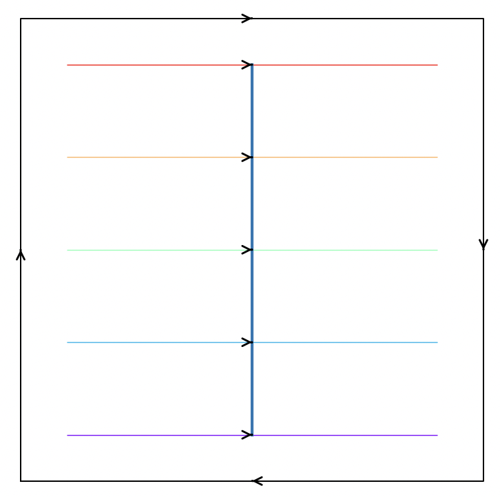
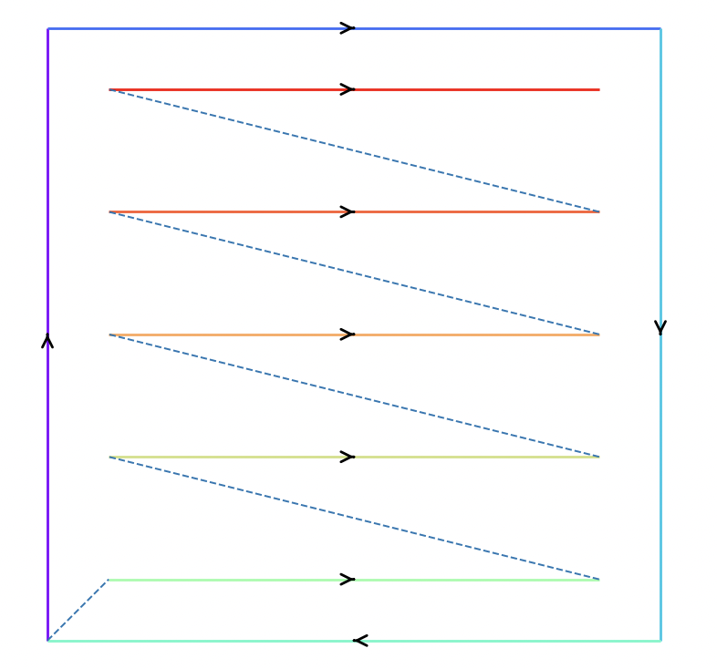
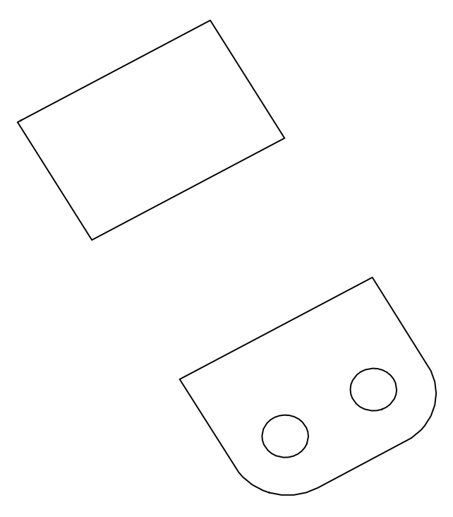

Visualisation
==================

There are a variety of visualisation tools available in PySLM. These are designed to interrogate
the scan paths or vectors generated by the PySLM algorithms or machine build files that are generated
by other build-processor software. Generally, any 3D geometry generated and stored via trimesh can be
trivially visualised in 3D (provided that the `pyglet <https://pyglet.org/>`_ library is installed). Likewise,
:class:`~pyslm.core.Part` can be plotted from the :attr:`~pyslm.core.Part.geometry` attribute.

.. code-block:: python

        import pyslm
        import numpy as np

        # Create a part
        solidPart = pyslm.Part('myFrameGuide')
        solidPart.setGeometry('../models/frameGuide.stl')

        solidPart.geometry.show()

        # Generally, any trimesh objects can be visualised in 3D

        # Create a trimesh object
        solidTrimeshPart = trimesh.load_mesh('../models/frameGuide.stl')
        solidTrimeshPart.show()

The remaining visualisation tools are designed to visualise the scan paths or vectors generated by the PySLM algorithms.
The visualisation tools are intended to be straightforward to use for visualising the scan vectors
and additional properties across a layer. The functionality builds upon the primitives provided in
the `pyslm.geometry` module, therefore the user should ensure any scan paths conform to this structure.
Nevertheless, other functions exist for visualising geometry paths.

The visualisation tools are available in the `pyslm.visualise` module. The :meth:`~pyslm.visualise.plot` function is the
main visualisation tool. The function takes a :class:`~pyslm.geometry.Layer` object as input and a set
of arguments to control its behavior. The plot function can be used to visualise the three layer geometry types:

* :class:`~pyslm.geometry.ContourGeometry` - A set of contour vectors
* :class:`~pyslm.geometry.HatchGeometry` - A set of hatch vectors
* :class:`~pyslm.geometry.PointsGeometry` - A set of individual exposure points

The plotting functionality can be controlled by the additional arguments, which can be used to indicate the scan order
and directionality of the vectors:

* ``plot3D`` - A boolean flag to plot the layer in 3D
* ``plotOrderLine`` - A boolean flag to plot the order of the hatch vectors
* ``plotArrows`` - A boolean flag to plot the arrows on the scan paths

Using the :meth:`pyslm.visualise.plot` function, the order of scanning for the hatch region can be displayed by setting
the parameter (``plotOrderLine=True``) and arrows can be enabled by setting the parameter `plotArrows` to `True`. The
order of scanning is indicated by the color map for the hatch vectors. The most simplest demonstration can be carried
out on a unit-square border, without any hatch infill, as shown:

.. code-block:: python

    import numpy as np
    import pyslm.visualise
    import pyslm.geometry as geom

    # Create a layer
    layer = geom.Layer()

    # Create a contour geometry
    contourGeom = geom.ContourGeometry(mid = 1, bid = 1)
    contourGeom.coords = np.array([[0.,0.],
                                   [0.,1],
                                   [1.,1.],
                                   [1.,0.],
                                   [0.,0.]])

    # Add the contour to the geometry
    layer.geometry.append(contourGeom)

    hatchGeom = geom.HatchGeometry()
    hatchGeom.mid = 1
    hatchGeom.bid = 2
    hatchGeom.coords = np.array([[0.1, 0.1], [0.9, 0.1], # Hatch Vector 1
                                 [0.1, 0.3], [0.9, 0.3], # Hatch Vector 2
                                 [0.1, 0.5], [0.9, 0.5], # Hatch Vector 3
                                 [0.1, 0.7], [0.9, 0.7], # Hatch Vector 4
                                 [0.1, 0.9], [0.9, 0.9]  # Hatch Vector xw5
                                ])

    # Append the layer geometry to the layer
    layer.geometry.append(hatchGeom)

    # Plot the Layer
    handle = pyslm.visualise.plot(layer, plot3D=False, plotOrderLine=True, plotArrows=True)

The return argument from the function provides a handle to the plot, which can be used to modify the plot further.
The handle is a tuple containing the figure and axis objects from the `matplotlib` library. This can be passed as
argument into subsequent plotting functions to overlay additional information.

The :meth:`pyslm.visualise.plotSequential` is a similar function to the :meth:`~pyslm.visualise.plot` function, but
is focused on plotting the scan paths in a sequential order in time and additionally presenting the any scan jumps.

.. code-block:: python

    # Plot using the plot sequential function
    pyslm.visualise.plotSequential(layer, plotJumps=True, plotArrows=True)

Plotting Additional Data
-------------------------------
It is possible to use a python lambda function to include additional data stored within
each :class:`~pyslm.geometry.BuildStyle` corresponding to the :class:`~pyslm.geometry.Model` for each set of scan paths.
Ensure that each :class:`~pyslm.geometry.LayerGeometry` has a corresponding set of BuildStyles in the
:class:`~pyslm.geometry.Model` when passing it to the lambda function. The lambda function must return a corresponding
array equivalent to the size of the scan vectors. The following example demonstrates how to plot the laser id for
the layer geometry.

.. code-block:: python

    def plotLaserId(models, hatchGeom):
        buildStyle = pyslm.analysis.utils.getBuildStyleById(models, hatchGeom.mid, hatchGeom.bid)
        return np.tile(buildStyle.laserId, [int(len(hatchGeom.coords)/2),1])

    (fig, ax) = pyslm.visualise.plot(layers[0], plot3D=False, plotOrderLine=True, plotArrows=False,
                                                index=lambda hatchGeom :plotLaserId(models, hatchGeom) )

Plotting Geometry Paths
-------------------------------

Another convenience function is the :meth:`pyslm.visualise.plotPolygon` function, which can be used to visualise
the paths that are generated from a myriad of polygon/path sources. This is especially useful during development of
scan-strategies and for visualising slices obtained from 3D meshes. This function can take the following:

* A list of open/closed paths, each consisting of coordinates
* A list of `shapely.geometry.Polygon` objects
* A list of `shapely.geometry.MultiPolygon` objects

The excerpt shows how the slice paths can be visualised using the :meth:`~pyslm.visualise.plotPolygon` function.

.. code-block:: python

    import pyslm
    import pyslm.visualise

    # Imports the part and sets the geometry to  an STL file (frameGuide.stl)
    solidPart = pyslm.Part('myFrameGuide')
    solidPart.setGeometry('../models/frameGuide.stl')

    solidPart.origin = [5.0, 10.0, 0.0]
    solidPart.rotation = np.array([0, 0, 30])
    solidPart.dropToPlatform()

    """
    Perform the slicing. Return coords paths should be set so they are formatted internally.
    This is internally performed using Trimesh to obtain a closed set of polygons.
    The boundaries of the slice can be automatically simplified if desired.
    """
    geomSlice = solidPart.getVectorSlice(z, simplificationFactor=0.1)

    pyslm.visualise.plotPolygon(geomSlice)

The output from the example mesh is shown below

